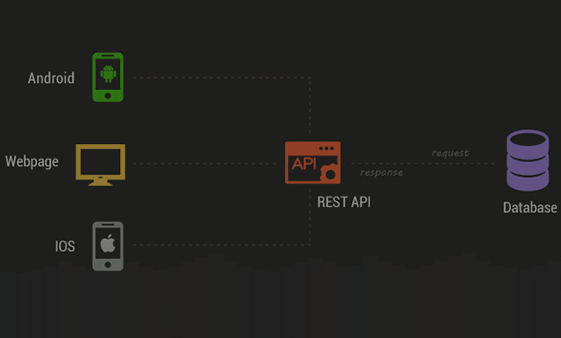

# Introduction to web development

`swathi.b@` | `athul.rt@` | `muhammed.ts@` | `ashish.k@`

[github](https://github.com/neoito-hub/intro-to-web-development-workshop)

[neoito](https://www.neoito.com/)

## How the web works


- Client sends `requests` and Server gives `responses`
- A request contains
  - A resource - `/posts/102`
  - A method - `GET, PUT, POST, DELETE`
  - A payload - JSON, XML
- A URL : `https://www.foo.com/search?q=Express&p=1`
  - a protocol
  - domain
  - uri
  - querystring

## What does a browser do?

- Parse an `HTML` document.
- Format it with `CSS`
- Make the document dynamic with `JS`
- DevTools `F12`
- Open any website and see the `Network` Tab of the DevTools
- Browsers are forgiving to developers.

## What is a service ?

- A program running on a port/socket on a machine, waiting for
  communication.
```
$ python -m SimpleHTTPServer
$ netstat -ntpl
```

## HTML, CSS, JS a.k.a Client-Side

- Markup 
  - tags
- Formatting
  - classes/ids
  - box-model
  - in-line and block-level elements
  - browser styles 
- Page/DOM manipulation
  - reacting to events
  - `Console` tab
  - ES5, ES6 ...
- **Lets build something with this!**

## A bit more on JS

- There are [engines](https://en.wikipedia.org/wiki/Chrome_V8) that run them.
- The `>>>` in the `Console` tab.
- Client side JS operates on the DOM. DOM specific APIs.
- APIs can also mean `libraries` used to interface with things
and not just `web-endpoints`.
- The joy/sorrow of event-driven programming. 

## Relevant parts of JS

- `var` (meh!), `let`, `const`
- `${string}` templates
- `Arrays` and `Objects` - `.map()`, `.filter()`
- `functions` and `callbacks`

## Data

| id  | name  | age  | 
|-----|-------|------|
| 100 | ram   |  10  |  
| 101 | rex   |  11  |
| 102 | ray   |  14  |

## JSON

- One 
  ```
  {
    id: 100,
    name: 'name',
    age: 10
  }
  ```
- Many
  ```
  [
    {id: 100, name: 'ram', age: 10},
    {id: 101, name: 'rex', age: 11},
    {id: 102, name: 'ray', age: 14},
  ]
  ```

## Let's build an app

- CRUD apps

## Fetching data from an API



- `fetch(url)`
- `callbacks` to `Promises`
- `Promises` to `async/await`

## Node.JS

- Javascript running on the server-side.
- Type in `node`
- `node script.js`
- No DOM APIs
- Node = V8 + C++ libs
- `require()` and `module.exports`
- `npm`
- Setting up a node project - `package.json`

## Let's build a REST API server

- Methods/Verbs
```
C - POST
R - GET
U - PUT
D - DELETE
```

- Status Codes
```
2xx Success
4xx Client Error
5xx Server Error
```

## Building a server - improved (express.js)

```
npm i --save express
```

## Databases

- DDL
```
CREATE TABLE ...
```

- DML
```
C INSERT 
R SELECT
U UPDATE
D DELETE
```

## Modify our API to use SQLite

```
npm i --save sqlite3 # this is a node API to SQLite
```

- **Warning:** Most libraries we find will be using callbacks

## A gentle into to Vue.JS

- Single Page Apps vs Server Side Rendered
- Component & State based design
- Vue basics!
- Let's build our first app with Vue

## Rebuilding the entire thing right!

- `npm i -g @vue/cli`

## Links

- [MDN](https://developer.mozilla.org/en-US/)
- [freeCodeCamp](https://www.freecodecamp.org/)
- [Roadmap](https://roadmap.sh/)
- [Awesome Node](https://github.com/sindresorhus/awesome-nodejs)
- [Our Handbook](https://devhandbook.neoito.com/newcomers/index.html)